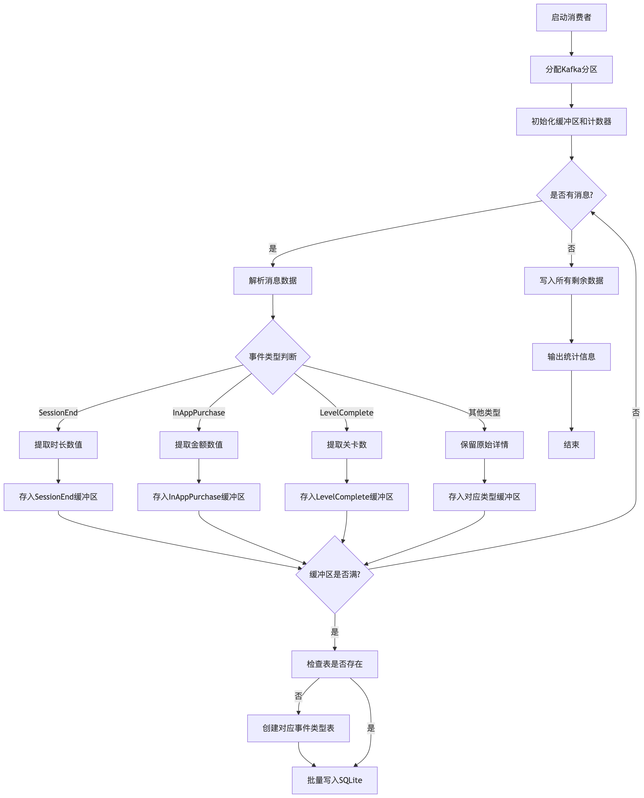

# Consumer.py 文档

## 概述
Consumer.py 是一个从Kafka消费游戏事件数据并批量存储到SQLite数据库的Python脚本。它处理来自Producer.py生成的各种游戏事件，按事件类型分类存储到不同的数据库表中。

## 功能
1. **Kafka消息消费**：
    - 从指定分区消费游戏事件数据
    - 支持批量处理消息(每批100条)

2. **数据预处理**：
    - 提取数值数据(如购买金额、会话时长)
    - 验证数据完整性

3. **SQLite存储**：
    - 按事件类型动态创建表
    - 批量插入数据提高效率

## 数据库设计
每个事件类型存储到单独的表，表名格式为`dwd_[EventType]`，表结构如下：

| 字段名 | 类型 | 描述 |
|--------|------|--------|
| EventID | TEXT | 事件唯一标识 |
| PlayerID | TEXT | 玩家标识 |
| EventTimestamp | TEXT | 事件时间戳 |
| EventType | TEXT | 事件类型 |
| EventDetails | TEXT | 事件详情 |
| DeviceType | TEXT | 设备类型 |
| Location | TEXT | 地理位置 |

## 特殊处理逻辑
1. **数值提取**：
    - `InAppPurchase`事件：从"Amount: X.XX"提取金额
    - `SessionEnd`事件：从"Duration: X.X mins"提取时长

2. **批量写入**：
    - 每100条数据批量写入一次
    - 程序结束前确保所有数据写入

## 配置参数
| 参数 | 描述 | 默认值 |
|------|------|--------|
| BATCH_SIZE | 批量写入大小 | 100 |
| TIMEOUT_MS | Kafka消费超时时间 | 3000ms |
| MAX_RECORDS | 每次最大拉取记录数 | 10000 |

## 依赖项
- kafka-python
- sqlite3
- re (正则表达式)
- collections.defaultdict

## 流程图



## 使用说明
1. 确保Kafka服务已启动并配置正确
2. 安装依赖：`pip install kafka-python`
3. 运行脚本：`python Consumer.py`

## 性能优化
1. 批量写入减少I/O操作
2. 表存在性检查缓存
3. 使用连接池管理数据库连接

## 输出示例
```
===> Kafka -> sqlite 批量写入完成，用时: 8.56 秒，消息总数: 5000
```