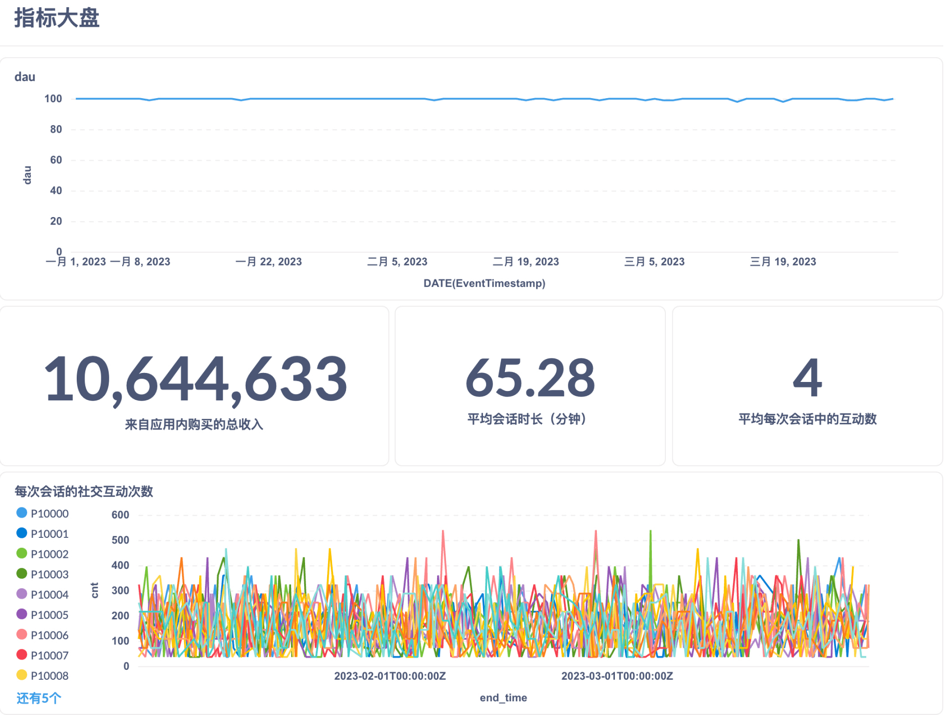

Metabase 是一个非常友好的 开源 BI 工具，适合直接用来可视化 SQLite 数据。  
你可以在本地或服务器上运行 Metabase，连接 .db 文件，快速构建仪表板。


```sh
docker run -d -p 3000:3000 \
  -v /Users/liangkaixin/Documents/featurestore-for-joycastle:/app/data \
  --name metabase \
  metabase/metabase
```
# dau
```sql
SELECT COUNT(DISTINCT playerid) as dau, DATE(EventTimestamp) FROM dwd_SessionStart GROUP BY 2;
```

# 来自应用内购买的总收入
```sql
SELECT Sum(EventDetails) FROM dwd_InAppPurchase;
```

# 平均会话时长
```sql
SELECT avg(EventDetails) FROM dwd_SessionEnd;
```

# 每次会话的平均社交互动次数
```sql
SELECT COUNT(*) / (SELECT COUNT(*) FROM dwd_SessionEnd) FROM dwd_SocialInteraction
```


# 用户每次会话的社交互动次数
```sql
SELECT t2.PlayerID       AS PlayerID,
t1.EventTimestamp AS end_time,
COUNT(*)          AS cnt
FROM (SELECT PlayerID,
             EventTimestamp,
             EventDetails,
             datetime(EventTimestamp, '-' || EventDetails || ' minutes') AS StartTimestamp
      FROM dwd_SessionEnd) t1
         JOIN dwd_SocialInteraction t2 ON
    t1.StartTimestamp <= t2.EventTimestamp AND
    t1.EventTimestamp >= t2.EventTimestamp
        AND t1.PlayerID = t2.PlayerID
GROUP BY t2.PlayerID, t1.EventTimestamp
;
```

[指标大盘.pdf](%E6%8C%87%E6%A0%87%E5%A4%A7%E7%9B%98.pdf)
